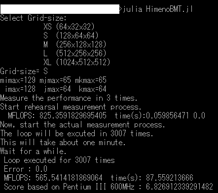

# Himeno Benchmark in Julia

This is a Julia program executing the Himeno Benchmark.

## Descriptions

This program is Himeno benchmark problem written in Julia 0.6.2.  
Is the Julia really fast against engineering problems?  
How do I study Julia's optimization techniques?  
Himeno Benchmark is a good problem to study those.  
This program was simply rewritten into Julia from [a program](https://github.com/degawa/Himeno-Benchmark-in-Modern-Fortran) which is rewritten in Modern Fortran style. Currently, the maximum performance of this program is 25% of that of the Modern Fortran program.  

## Demo


## Requirement
Julia 0.6.2

## Usage

1. execute the .jl file like below:
```console
> julia HimenoBMT.jl
```
2. input Grid-size from a keyboard
3. The program will be run during roughly 60 seconds
4. Benchmark results will be displayed after an execution is successfully done

## Installation
git clone or simply download .jl file

## Licence
LGPL 2 or later